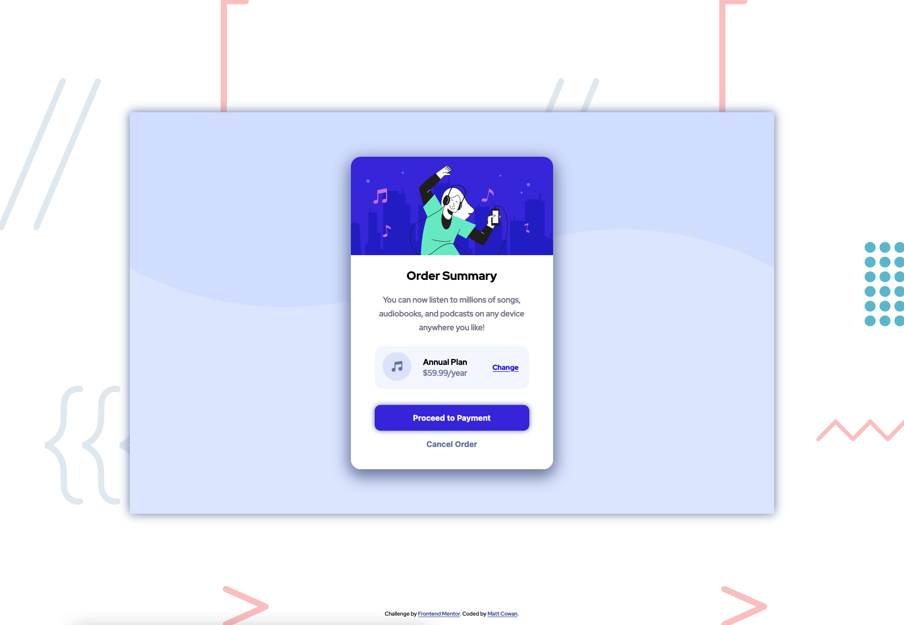
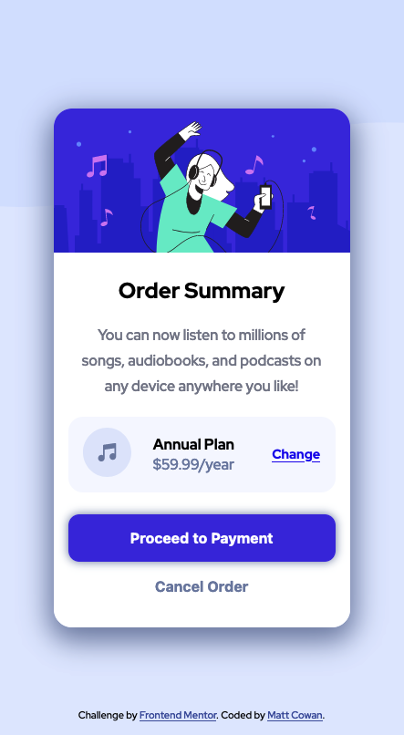

# Frontend Mentor - Order summary card solution

This is a solution to the [Order summary card challenge on Frontend Mentor](https://www.frontendmentor.io/challenges/order-summary-component-QlPmajDUj). Frontend Mentor challenges help you improve your coding skills by building realistic projects.

## Table of contents

- [Overview](#overview)
  - [The challenge](#the-challenge)
  - [Screenshot](#screenshot)
  - [Links](#links)
- [My process](#my-process)
  - [Built with](#built-with)
  - [What I learned](#what-i-learned)
  - [Continued development](#continued-development)
  - [Useful resources](#useful-resources)
- [Author](#author)

## Overview

### The challenge

Users should be able to:

- See hover states for interactive elements

### Screenshot

### Links

- Solution URL: [Solution](https://mattbcowan.github.io/order-summary-component-main/)

## My process

I started off by dropping the JPEG's into Figma to get some sizes and try to figure out every detail of the project.

After that I went through the process of cleaning up the HTML and wrapping the different sections in their accompanying tags. I separated the header and main content first then moved on to the smaller sections.

CSS was up next and I chose to go with a mobile-first approach. I went through and styled the container, moved to the card overall style then the individual components. After the mobile was taken care of I moved on to the desktop version. Since I built this mobile first about 90% of the work was done, so it was just changing some margins and sizes. Finally the hover effects for the buttons and we are done.

### Built with

- Semantic HTML5 markup
- CSS custom properties
- Flexbox
- CSS Grid
- Mobile-first workflow

### What I learned

I had quite a bit of fun with this project. I learned how to implement CSS Grid and Flexbox together. Along with that I got to play more with media queries and mobile-first workflow which I've been focusing on.

### Continued development

I definitely would like to learn more about Accessibility and SEO. I feel like that could help shape the code that I'm writing to flow better.

### Useful resources

- [CSS Tricks](https://css-tricks.com/) - I feel like this ones a given. The guides on Flexbox and CSS Grid are life savers at all times. This is typically my go to for anything CSS related.

- [MDN Docs - HTML Elements](https://developer.mozilla.org/en-US/docs/Web/HTML/Element) - I've been learning about Accessibility and these docs are amazing. Rather than using all divs like I did when I started out I've started trying to be more thoughtful with the tags I use and MDN is always up at the ready.

## Author

- Website - [Matt Cowan](https://mattbcowan.com/)
- Frontend Mentor - [@mattbcowan](https://www.frontendmentor.io/profile/mattbcowan)
- Twitter - [@mattbcowan](https://twitter.com/MattBCowan)
